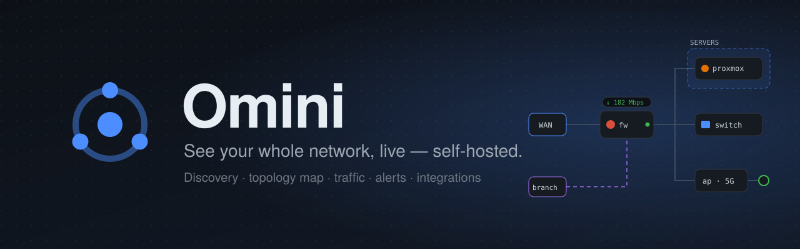
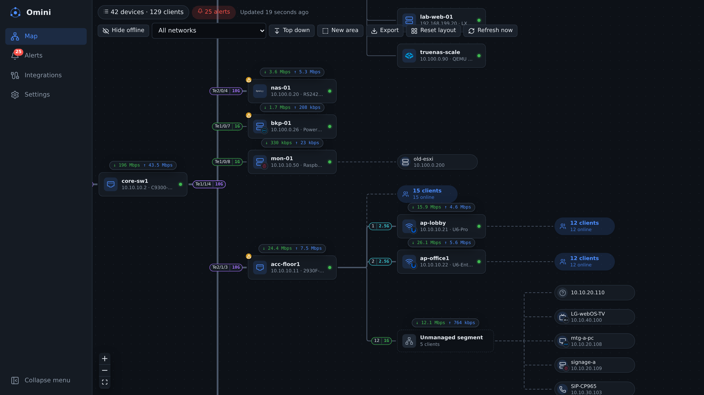
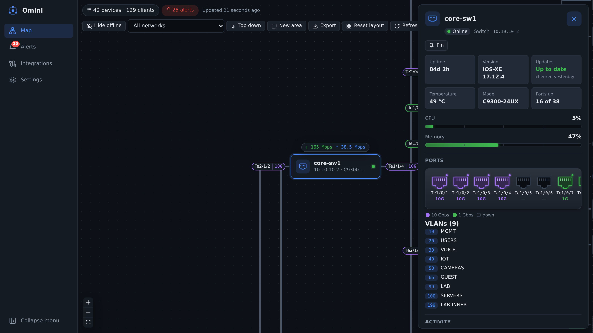
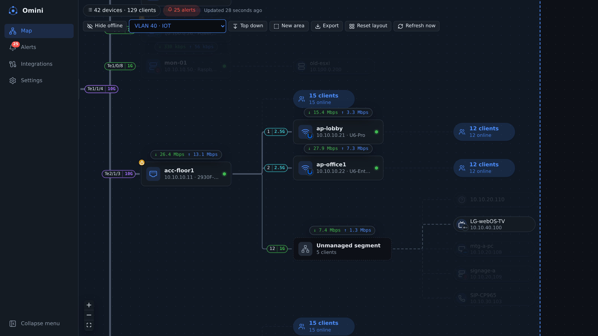
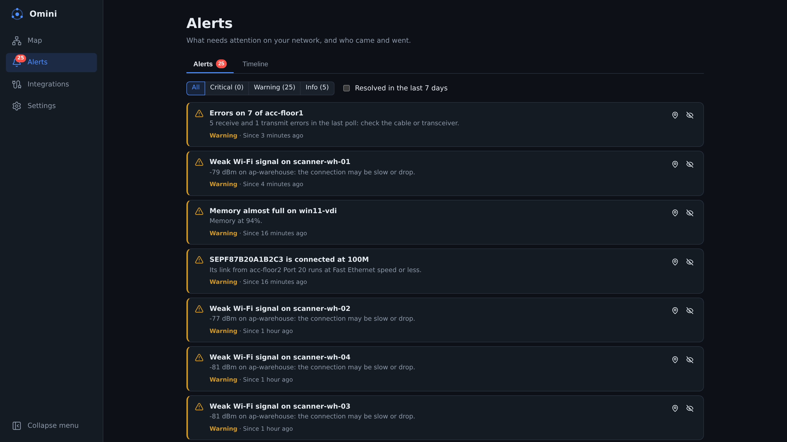
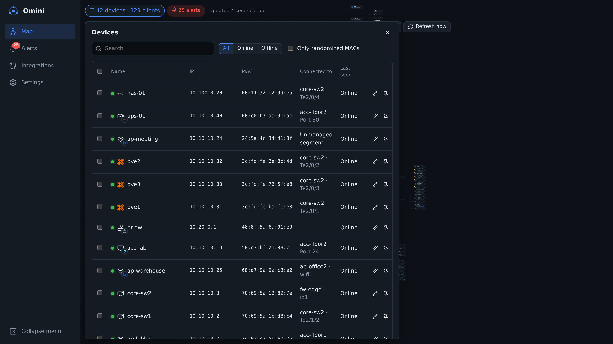
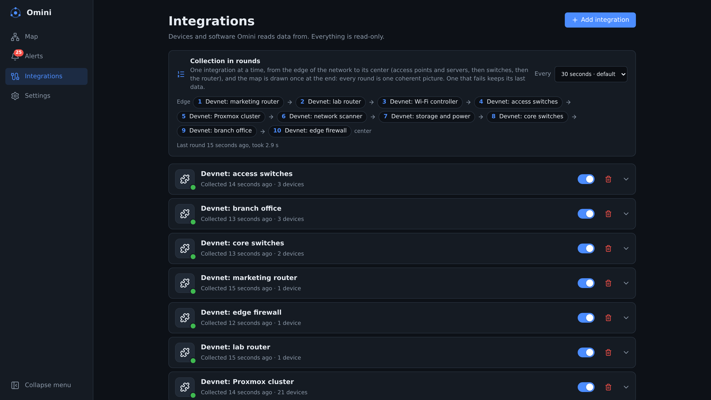
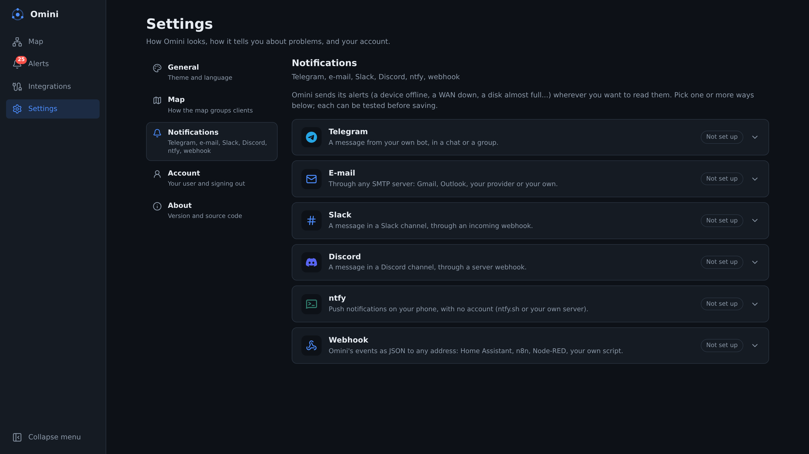
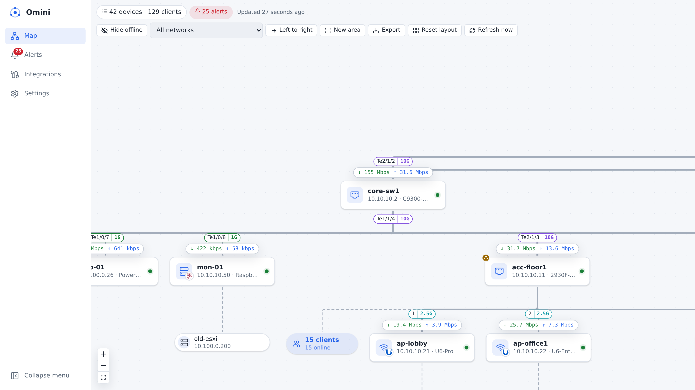

<p align="center">
  
</p>

<p align="center">
  <a href="https://github.com/riccardoalv/omini/releases/latest"></a>
  <a href="https://hub.docker.com/r/riccardoalv/omini"></a>
  <a href="https://github.com/riccardoalv/omini/actions/workflows/ci.yml"></a>
  <a href="LICENSE"></a>
</p>

**Omini** is a self-hosted, open source network map for homelabs and small networks. Start it and, within a minute, it finds every device on your network, recognizes what each one is, and draws a **live map** of what is plugged into what: ports, link speeds, traffic, Wi-Fi clients, VMs and the apps running on them. Connect your firewall, switches, access points and hypervisors in a few clicks and the map gets sharper, with health data and alerts sent to Telegram, Discord, Slack, ntfy or e-mail.

It runs as one small container (amd64 and arm64, a Raspberry Pi is enough), keeps everything in an embedded database, and **only reads**: Omini never changes the configuration of your devices.

<p align="center">
  
</p>

## Features

- **Zero-config discovery.** ARP, ping, common ports, reverse DNS, NetBIOS, mDNS, SSDP/UPnP and SNMP (v2c and v3), plus optional nmap for operating systems and service versions. The networks behind your routers are scanned too.
- **Device identification.** Type, operating system, brand, model and self-hosted apps (2,600+ recognized) with the evidence behind each guess, shown with their own icons. You can correct anything by hand.
- **A topology map that builds itself.** LLDP neighbors, MAC tables, ARP, DHCP leases and Wi-Fi client lists are cross-referenced to work out each device's switch port or access point. Devices without an API (unmanaged switches, APs in bridge mode) are inferred from what the others see.
- **Live traffic.** Every device shows its current download and upload, every link its port and speed. Click a link or port for its history (per minute for a day, hourly for a year). "Who talks to whom" comes from NetFlow, IPFIX or sFlow.
- **A device panel.** CPU, memory, temperatures, disks, pending updates, a front view of the ports (RJ45 and SFP, colored by speed, with optics readings), VLANs, VPN peers, services, DHCP pools, the devices it talks to, and its presence timeline.
- **Alerts that matter.** 27 rules: device offline, WAN gateway down, duplicate IP, links that fell to 100 Mbps or half duplex, flapping ports, low SFP signal, full disks, hot CPUs, insecure services, full DHCP pools, a burst of new devices, and more. Each comes with a hint on what to do.
- **Notifications.** Telegram, e-mail, generic webhooks (signed with HMAC), Slack, Discord and ntfy, grouped per device and never repeated while an alert flaps.
- **Your map, your way.** Left-to-right or top-down layout, named and colored areas, fold any node's children into a bubble, VLAN and subnet filter, hide devices. Export to PNG, SVG, draw.io or JSON.
- **Integrations and a plugin store.** One-click plugins for OPNsense, pfSense, MikroTik, UniFi, Omada, OpenWrt, Proxmox (clusters included), Mercusys Halo and Horaco switches. Any GitHub repository can be installed too, and plugins are short Python scripts.
- **Built for your server.** Single admin login, credentials encrypted at rest, dark and light themes, English and Brazilian Portuguese.

## Screenshots

| | |
|---|---|
|  |  |
| **Device panel**: health, a front view of the ports, traffic and alerts | **VLAN and subnet filter**: what belongs to a network, framed |
|  |  |
| **Alerts**: with hints, popups and a presence timeline | **Inventory**: every device ever seen, where it is connected |
|  |  |
| **Integrations**: built-in scans and plugins from the store | **Notifications**: Telegram, e-mail, Discord, Slack, ntfy, webhooks |

<p align="center">
  
</p>

## Quick start

With Docker (Docker Hub `riccardoalv/omini` or `ghcr.io/riccardoalv/omini`):

```bash
docker run -d --name omini --network host --restart unless-stopped \
  -v omini-data:/data riccardoalv/omini:latest
```

Or with Compose:

```yaml
services:
  omini:
    image: riccardoalv/omini:latest
    container_name: omini
    network_mode: host # the scan must see your LAN (ARP, mDNS, SSDP)
    restart: unless-stopped
    volumes:
      - ./data:/data
    environment:
      TZ: UTC
      # OMINI_NMAP: install   # installs nmap on start, for OS and version detection
```

Open `http://<your-server>:8080`, create the admin account, and watch the map fill in. Then add your firewall, switches or hypervisor in **Integrations → Add integration**.

Host networking matters: in a Docker bridge network Omini only sees Docker's own network. [Installation](docs/installation.md) covers building from source, systemd, upgrades and backups.

## Documentation

| For users | For developers |
|---|---|
| [Installation](docs/installation.md) | [Writing a plugin](docs/plugins.md) |
| [Configuration](docs/configuration.md) | [HTTP API](docs/api.md) |
| [Discovery](docs/discovery.md): what the scan finds and needs | [Architecture](docs/architecture.md) |
| [The map](docs/map.md) | [Development](docs/development.md) |
| [Alerts and notifications](docs/alerts.md) | [SNMP profiles](docs/snmp-profiles.md) |
| [Integrations](docs/integrations.md): each plugin and its read-only account | [Plugin review](docs/plugin-review.md) |
| [Troubleshooting](docs/troubleshooting.md) | [Decisions](docs/decisions.md): what was decided and why |

## Integrations

| Integration | How | What it adds |
|---|---|---|
| Network scan | Built in, on by default | Every device: IP, MAC, vendor, names, open ports, mDNS/UPnP models, SNMP (interfaces, traffic, LLDP, MAC tables) |
| nmap | Built in, uses the nmap on the host | Operating systems and service versions; scan one device from its panel |
| Traffic flows | Built in, listens on UDP 2055 and 6343 | Conversations from NetFlow v5/v9, IPFIX and sFlow v5 |
| [OPNsense](https://github.com/riccardoalv/omini-plugin-opnsense) | Plugin, REST API | Interfaces, link speed and media, ARP, DHCP, gateways, health, updates, VPN, services, firewall states, SFP optics |
| [Proxmox VE](https://github.com/riccardoalv/omini-plugin-proxmox) | Plugin, API token | Nodes and clusters, VMs and containers on the right host, CPU, memory, disks |
| [Horaco](https://github.com/riccardoalv/omini-plugin-horaco) | Plugin, web interface | Ports, RJ45/SFP, counters, MAC table (switches without SNMP) |
| [Mercusys Halo](https://github.com/riccardoalv/omini-plugin-mercusys) | Plugin, local web interface | Mesh units, Wi-Fi and wired clients, bands, traffic |
| MikroTik, UniFi, Omada, OpenWrt, pfSense | Plugins | See [Integrations](docs/integrations.md) for each one's status |

Plugins live in their own repositories and are installed from the built-in store. Each shows a publisher badge (official or community) and a trust level given by the maintainers (plug-and-play, stable, experimental or unverified), as described in [Plugin review](docs/plugin-review.md).

## How it works

```
 network scan · nmap · flows        plugins (OPNsense, Proxmox, ...)
            │                                  │
            ▼                                  ▼
 ┌──────────────────────────────────────────────────────────┐
 │ Collector: one round at a time, from the edge of the     │
 │ network to its center; counters become traffic rates     │
 └───────────────────────────┬──────────────────────────────┘
                             ▼
 ┌──────────────────────────────────────────────────────────┐
 │ Topology engine → alerts → notifications · SQLite        │
 └───────────────────────────┬──────────────────────────────┘
                             ▼
                     HTTP API → web UI
```

The core is written in **Go**: discovery, SNMP, topology, traffic and the API in one binary with the web UI (Vue 3) embedded. Vendor-specific integrations are **Python** plugins that read their config as JSON on stdin and print devices as JSON on stdout. The data contract is a JSON Schema from which both sides are generated. See [Architecture](docs/architecture.md).

## Security

- **Read-only**: no integration sends commands that change a device. Give each integration a read-only account ([Integrations](docs/integrations.md) shows how).
- Login is required. The admin user is created on the first visit.
- Device credentials are encrypted at rest. Secrets are never shown again or written to logs.
- Plugins run code on your server and receive the credentials you give them, so install only plugins you trust.

## Roadmap

- Write actions (disable a port, change a VLAN) behind explicit permissions
- More plugins and SNMP profiles, reviewed on real hardware
- More languages

Ideas and requests are welcome in the [issues](https://github.com/riccardoalv/omini/issues).

## Contributing

Contributions are very welcome, especially **SNMP profiles**, **plugins** and **anonymized device data** for tests. Start with [Development](docs/development.md) and [CONTRIBUTING.md](CONTRIBUTING.md).

## Credits

- Device and software logos: [Simple Icons](https://simpleicons.org) (CC0-1.0).
- App icons and catalog: [Dashboard Icons](https://github.com/homarr-labs/dashboard-icons) by homarr-labs (Apache-2.0).
- MAC vendors: [IEEE registration authority](https://standards-oui.ieee.org/) (MA-L registry).
- Device model names: [Google Play supported devices](https://support.google.com/googleplay/answer/1727131) and a [community list of Apple identifiers](https://gist.github.com/adamawolf/3048717).
- Deep scans: [nmap](https://nmap.org), when installed on the host (not distributed with Omini).
- Logos and trademarks belong to their respective owners. Omini is not affiliated with them.

## License

[MIT](LICENSE)
